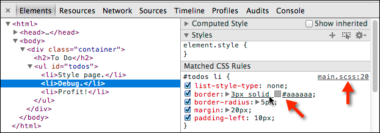

# Credits
This SASS style guide has been borrowed from this blog post by Chris Coyier for CSS Tricks cf. https://css-tricks.com/sass-style-guide/

# Status
For instance, this is just a markdowned version of the blog post, because it's such a good starting point to build our own style guide, so it will change a bit in the future commits.

## If you are a member of this repository please update me or provide a pull request

***********

# List @extend(s) First

```scss
.weather {
  @extend %module;
  ...
}
```

Knowing right off the bat that this class inherits another whole set of rules from elsewhere is good. Another benefit is that overriding styles for that inherited set of rules becomes much easier.

Knowing when to use @extend versus @include can be a little tricky. Harry does [a nice job of differentiating the two](http://csswizardry.com/2014/11/when-to-use-extend-when-to-use-a-mixin/) plus offers thoughts on how to use them both.

# List @include(s) Next

```scss
.weather {
  @extend %module;
  @include transition(all 0.3s ease-out);
  ...
}
```

Next up is your @includes for mixins and other functions. Again, this is nice to have near the top for reference, but also allows for overrides. You might also want to make the call on separating user-authored @includes and vendor-provided @includes.

# List "Regular" Styles Next

```scss
.weather {
  @extend %module;
  @include transition(all 0.3s ease-out);
  background: LightCyan;
  ...
}
```

Adding out regular styles after the @extends and @includes allows us to properly override those properties, if needed.

# Nested Pseudo Classes and Pseudo Elements Next

```scss
.weather {
  @extend %module;
  @include transition(all 0.3s ease-out);
  background: LightCyan;
  &:hover {
    background: DarkCyan;
  }
  &::before {
    content: "";
    display: block;
  }
  ...
}
```

Pseudo elements and pseudo classes directly related to the element itself so, for that reason, we nest them first before other selectors. Having pseudo elements come before classes seems to be a bit easier to read, but whether one comes before the other is totally a preference. Either way, it might be best to keep elements with other elements and classes with other classes.

# Nested Selectors Last

```scss
.weather {
  @extend %module;
  @include transition(all 0.3s ease);
  background: LightCyan;
  &:hover {
    background: DarkCyan;
  }
  &::before {
    content: "";
    display: block;
  }
  > h3 {
    @include transform(rotate(90deg));
    border-bottom: 1px solid white;
  }
}
```

Nothing goes after the nested stuff. And the same order as above within the nested selector would apply.

# Never Write Vendor Prefixes

Vendor prefixes are a time-sensitive thing. As browsers update over time, the need for them will fall away. If you use [Autoprefixer](https://css-tricks.com/autoprefixer/), when compiling Sass, then you should never have to write them.

Alternatively, you can use @mixins provided by libraries like Compass and Bourbon. Or roll your own. Although using @mixins for vendor prefixes is still less convenient than Autoprefixer and still requires some maintenance, it still beats having to write things out manually.

# Maximum Nesting: Three Levels Deep

```scss
.weather {
  .cities {
    li {
      // no more!
    }
  }
}
```

Chances are, if you're deeper than that, you're writing a crappy selector. Crappy in that it's too reliant on HTML structure (fragile), overly specific (too powerful), and not very reusable (not useful). It's also on the edge of being difficult to understand.

If you really want to use tag selectors because the class thing is getting too much for you, you may want to get pretty specific about it to avoid undesired cascading. And possibly even make use of @extend so it has the benefit on the CSS side of re-usability.

```scss
.weather
  > h3 {
    @extend %line-under;
  }
}
```

# Maximum Nesting: 50 Lines

If a nested block of Sass is longer than that, there is a good chance it doesn't fit on one code editor screen, and starts becoming difficult to understand. The whole point of nesting is convenience and to assist in mental grouping. Don't use it if it hurts that.

# Global and Section-Specific Sass Files Are just Table of Contents

In other words, no styles directly in them. Force yourself to keep all styles organized into component parts.

# List Vendor/Global Dependencies First, Then Author Dependencies, Then Patterns, Then Parts

It ends up being an easy to understand table of contents:

```scss
/* Vendor Dependencies */
@import "compass";

/* Authored Dependencies */
@import "global/colors";
@import "global/mixins";

/* Patterns */
@import "global/tabs";
@import "global/modals";

/* Sections */
@import "global/header";
@import "global/footer";
```

The dependencies like Compass, colors, and mixins generate no compiled CSS at all, they are purely code dependencies. Listing the patterns next means that more specific "parts", which come after, have the power to override patterns without having a specificity war.

# Break Into As Many Small Files As Makes Sense

There is no penalty to splitting into many small files. Do it as much as feels good to the project. I know I find it easier to jump to small specific files and navigate through them than fewer/larger ones.

```scss
...

@import "global/header/header/";
@import "global/header/logo/";
@import "global/header/dropdowns/";
@import "global/header/nav/";
@import "global/header/really-specific-thingy/";
```

I'd probably do this right in the global.scss, rather than have global @import a _header.scss file which has its own sub-imports. All that sub-importing could get out of hand.

[Globbing](https://github.com/chriseppstein/sass-globbing) might help if there starts to be too many to list.

# Partials are named _partial.scss

This is a common naming convention that indicates this file isn't meant to be compiled by itself. It likely has dependencies that would make it impossible to compile by itself. Personally I like dashes in the "actual" filename though, like _dropdown-menu.scss.

# Locally, Compile with Source Maps

In development, it probably doesn't matter which format you compile your Sass in (e.g. expanded, compressed, etc) locally as long as you are producing source maps.

It's a flag when you compile Sass:

`$ sass sass/screen.scss:stylesheets/screen.css --sourcemap`

Although you probably don't compile Sass like that typically, there is always some kind of way to configure the thing you're using to compile Sass to do it with source maps. When you have them, that means DevTools shows you where the Sass code is, which is super (duper) useful:



Here's a few relevant links on this:

- (Google) [Working with CSS Preprocessors](https://developer.chrome.com/devtools/docs/css-preprocessors)
- (The Sass Way) [Using source maps with Sass 3.3](http://thesassway.com/intermediate/using-source-maps-with-sass)

# In Deployment, Compile Compressed

Live websites should only ever have compressed CSS. And gzipped with far-our expires headers to boot.

# Don't Even Commit .css Files

This might take some DevOps work, but it's pretty nice if .css files aren't even in your repository. The compilation happens during deployment. So the only thing you see in the repo are your nicely formatted hand authored Sass files. This makes the diffs useful as well. A diff is a comparison view of what changed provided by version control providers. The diff for a compressed CSS file is useless.

# Be Generous With Comments

It is rare to regret leaving a comment in code. It is either helpful or easily ignorable. Comments get stripped when compiling to compressed code, so there is no cost.

```scss
.overlay {
  // modals are 6000, saving messages are 5500, header is 2000
  z-index: 5000;
}
```

And speaking of comments, you may want to standardize on that. The // syntax in Sass is pretty nice especially for blocks of comments, so it is easier to comment/uncomment individual lines.

# Variablize All Common Numbers, and Numbers with Meaning

If you find yourself using a number other than 0 or 100% over and over, it likely deserves a variable. Since it likely has meaning and controls consistency, being able to tweak it en masse may be useful.

If a number clearly has strong meaning, that's a use case for variablizing as well.

```scss
$zHeader: 2000;
$zOverlay: 5000;
$zMessage: 5050;

.header {
  z-index: $zHeader;
}
.overlay {
  z-index: $zOverlay;
}
.message {
  z-index: $zMessage;
}
```

Ideally, those numbers should probably be kept in a separate file @import-ed as a dependency. That way you can keep track of your whole z-index stack in one place. If, however, the variables are scoped to the class, then it would make sense to make sure they come first before any other rules.

```scss
.accordion {
  $accordion-header-color: $primary-color;
  $accordion-padding: 1em;

  @extend %module;
  @include transition(all 0.3s ease-out);
  background: $accordion-header-color;
  padding: $accordion-padding;
}
```

# Variablize All Colors

Except perhaps white and black. Chances are a color isn't one-off, and even if you think it is, once it's in a variable you might see uses for it elsewhere. Variations on that color can often be handled by the Sass [color functions](http://sass-lang.com/docs/yardoc/Sass/Script/Functions.html) like lighten() and darken() - which make updating colors easier (change in one place, whole color scheme updates).

# Nest and Name Your Media Queries

The ability to nest media queries in Sass means 1) you don't have to re-write the selector somewhere else which can be error prone 2) the rules that you are overriding are very clear and obvious, which is usually not the case when they are at the bottom of your CSS or in a different file.

```scss
.sidebar {
  float: right;
  width: 33.33%;
  @include bp(mama-bear) {
    width: 25%;
  }
}
```

[More on this](http://css-tricks.com/naming-media-queries/) and the importance of naming them well.

# Shame Last

In your global stylesheet, @import a _shame.scss file last.

```scss
@import "compass"

...

@import "shame"
```

If you need to make a quick fix, you can do it here. Later when you have proper time, you can move the fix into the proper structure/organization. [See more](http://csswizardry.com/2013/04/shame-css/).

# Final Output Is On You

scss doesn't do anything you don't tell it to do, so claiming that Sass output is bloated is just claiming that you write bloated code. Write Sass such that the final CSS output is just as you would have written it without Sass.
